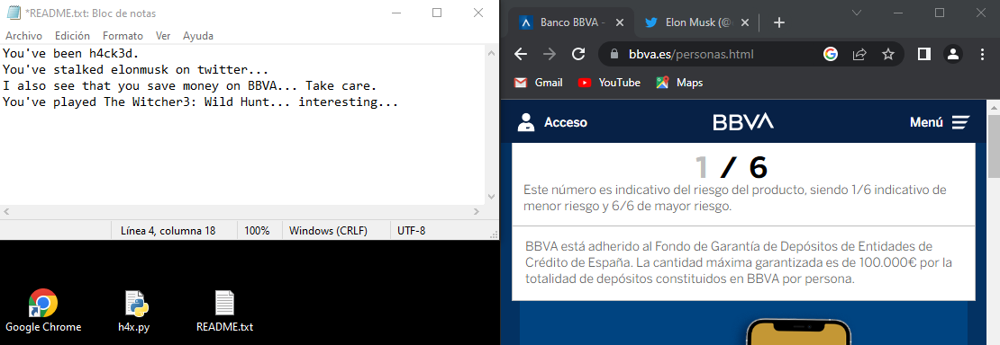

# h4x.py
Python program to prank your friends accessing their data and making a "HACKED" file on their desktop.

---
Thanks to [mastermind](https://www.mastermind.ac/) for this incredible idea and their brilliant courses and platform.
Here is a demostration of how the script works on a windows computer, feel free to modify the path function to adapt the script to a linux OS.

---

